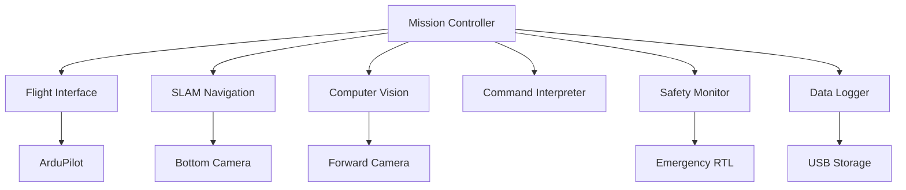

# Aero Companion System Architecture

[](https://python.org)
[](https://opencv.org)
[](https://ultralytics.com)
[](https://mavlink.io)

**Phase 1**: Implementing semi-autonomous capabilities with manned pilots controlling drones through user-friendly web applications.


Welcome to [**Aero Companion**](https://github.com/caddison/AeroCompanion/wiki) an autonomous drone that boasts cutting edge capabilities including real-time video streaming, computer vision, and GPS independent navigation. 


---


## Project Overview

This project leverages the capabilities of the Raspberry Pi 5 and Pixhawk 6X flight controller to create a cutting-edge drone capable of executing complex autonomous tasks. The drone is designed to operate without GPS, utilizing IMU data and computer vision for navigation.

---

## Key Features

### Autonomous Flight Control
- Utilizes the **Pixhawk 6X** flight controller for precise and reliable flight control.
- Implements CV models to handle autonomous navigation and tracking.

### Real-Time Video Streaming
- Streams live video feed from the drone's camera to a web application or **Vuzix Blade** smart glasses for FPV (First Person View) experience.
- Provides video transmission over a **Sixfab 4G/LTE cellular modem** for extended range operations.

### Computer Vision and Obstacle Avoidance
- Employs a secondary downward-facing camera for movement tracking and obstacle detection.
- Integrates computer vision algorithms for target tracking, obstacle avoidance, and payload delivery.

### GPS-Free Navigation
- Relies on IMU data and visual tracking for navigation, ensuring continued operation even in GPS-denied environments.

### Modular Design
- Features a modular payload system allowing for easy swapping of sensors and equipment based on mission requirements.
- Designed for versatility, making it suitable for various applications such as surveillance, delivery, and environmental monitoring.

### Enhanced User Interface
- Provides a web-based control interface compatible with mobile devices, featuring joystick controls and voice command capabilities.
- Integrates with **Vuzix Blade AR smart glasses** to offer augmented reality overlays and voice command input.

---

## Technical Specifications

- **Flight Controller**: Pixhawk 6X
- **Processor**: Raspberry Pi 5
- **Camera**: Raspberry Pi Camera
- **Connectivity**: Sixfab 4G/LTE Cellular Modem
- **Materials**: Lightweight and durable 3D-printed mounts and frames

---

## Useful Commands
These commands are designed for a wide range of commercial applications and allow users to utilize the drone for tasks such as inspection, delivery, and surveillance in various industries:

**Move Up / Move Down**: Vertical navigation for getting the drone to the required altitude.

**Pan Left / Pan Right**: Adjust the drone’s orientation for full 360-degree coverage.

**Move Forward / Move Backward**: Basic forward or backward movement for navigating environments.

**Move Left / Move Right**: Rotate the drone to adjust the camera or sensors without changing position.

**Hover**: Stabilize the drone in one place for a detailed inspection or data capture.

**Track**: Automatically follow a moving object, such as a person or vehicle, based on real-time visual data.

**Go To Route**: Pre-program a route using GPS for the drone to follow autonomously.

**Release Payload**: Navigate to a specific location and release a payload.

**Return Home**: Command the drone to return to its launch point.

**Capture Data**: Record visual data for later analysis or real-time transmission to the user.

---


# Autonomous System Architecture

[](https://python.org)
[](https://opencv.org)
[](https://ultralytics.com)
[](https://mavlink.io)

**Phase 2**: Transitioning from command-based manual operation to fully autonomous, modular system with USB mission profiles.

An intelligent drone system that reads mission objectives from USB and executes autonomous operations using computer vision, SLAM navigation, and safety monitoring.

## System Overview



## Core Modules

### 1. Mission Controller

**Purpose:** Central coordinator that orchestrates all other modules

**Key Responsibilities:**
- Parse Program Objectives from USB
- Maintain mission state machine
- Coordinate all modules
- **Priority**: Safety > Mission > Efficiency

---

### 2. Flight Interface Module

**Purpose:** Handles MAVLink communication with ArduPilot

**Features:**
- Real-time telemetry (GPS, battery, attitude)
- Flight mode control
- MAVLink command handling
- Safety parameter enforcement

---

### 3. SLAM Navigation Module

**Purpose:** Tracks position via visual SLAM using bottom-facing camera and AI HAT+

**Capabilities:**
- ORB-SLAM implementation
- Home position reference
- Drift detection

---

### 4. Computer Vision Module

**Purpose:** Detects and tracks objects using AI HAT+

**Intelligence:**
- Real-time YOLOv8n inference
- Object tracking
- Distance estimation

---

### 5. Command Interpreter Module

**Purpose:** Converts high-level commands into drone actions

**Supported Commands:**

| Command | Description | Use Case |
|---------|-------------|----------|
| `hover` | Maintain position using computer vision | Stable observation |
| `track` | Follow object at defined distance | Wildlife monitoring |
| `guard` | Circle/patrol an area | Perimeter security |
| `find` | Search pattern for specific target | Search & rescue |
| `surveil` | Observe area/object for duration | Surveillance ops |
| `recon` | Map and scan defined region | Area mapping |
| `goto` | Navigate to coordinates | Waypoint missions |
| `return` | Return home using SLAM/GPS | Mission completion |

---

### 6. Safety Monitor Module

**Purpose:** Continuous safety and health monitoring

**Safety Features:**
- Smart battery reserve calculation
- Geofence boundary enforcement
- System health monitoring
- Automatic emergency RTL

---

### 7. Data Logger Module

**Purpose:** Mission telemetry and data recording

**Data Management:**
- Timestamped event logging
- Flight path and telemetry logs
- Mission reports

## Mission Configuration

### Program Objectives File Format

Missions are defined in JSON format on USB drive:

```json
{
  "mission_id": "wildlife_survey_001",
  "metadata": {
    "created": "2024-07-24T10:30:00Z",
    "operator": "research_team",
    "location": "yellowstone_sector_7"
  },
  "parameters": {
    "max_flight_time": 1200,     
    "battery_reserve": 20,       
    "max_altitude": 50,          
    "track_distance": 15,        
    "geofence_radius": 500       
  },
  "objectives": [
    {
      "command": "find",
      "target": "bird",
      "area": "circle",
      "radius": 100,
      "timeout": 300,
      "priority": "high"
    },
    {
      "command": "track",
      "duration": 180,
      "distance": 15,
      "record_video": true,
      "follow_mode": "adaptive"
    },
    {
      "command": "surveil",
      "duration": 120,
      "area": "current_position",
      "altitude": 30
    },
    {
      "command": "return",
      "method": "slam_primary"
    }
  ]
}
```

## System Flow

### Startup Sequence

```
1. Boot & Initialize → Load modules & connect flight controller
2. Mission Load → Parse objectives from USB
3. Pre-Flight Check → Verify all systems green
4. SLAM Initialize → Set home position reference
5. Takeoff → Begin mission at safe altitude
```

### Emergency Handling

| Trigger | Response | Fallback |
|---------|----------|----------|
| Low Battery | Immediate RTL | Critical landing |
| SLAM Failure | GPS-only mode | Manual override |
| Geofence Breach | Forced return | Emergency stop |

## Development Roadmap

### Phase 1: Foundation *(Completed)*
- [x] Flight Interface Module
- [x] Basic Mission Controller  
- [x] Safety Monitor Framework

### Phase 2: Navigation *(Current Phase)*
- [ ] SLAM Navigation Module
- [x] Command Interpreter
- [x] USB Program Objectives Parser

### Phase 3: Intelligence
- [ ] Computer Vision Module 
- [ ] Advanced command implementations
- [x] Data Logger with analytics

### Phase 4: Field Testing 
- [ ] Full module integration
- [ ] Real-world field testing
- [ ] Performance optimization


# Agentic System Architecture

[](https://python.org)
[](https://opencv.org)
[](https://ultralytics.com)
[](https://mavlink.io)

**Phase 3**: Evolution into an intelligent agentic architecture enabling end-to-end automation and integration with enterprise systems.

In this phase, Aero Companion transitions from manual or pre-scripted operation to an intelligent, event-driven system where autonomous agents manage mission workflows based on real-world triggers. The drone system becomes deeply integrated with customer operations, logistics systems, and edge/cloud-based agents that drive mission planning, coordination, and oversight.

# Workflow Integration - n8n 

Using n8n these integrations transform your autonomous drone into a complete business solution that seamlessly connects with existing enterprise systems.

## Real-Time Alert & Response Workflows

### Security Monitoring Pipeline
Transform your drone into an intelligent security system that automatically responds to threats:

- **Instant Threat Detection**: Computer vision module feeds directly into n8n workflows
- **Multi-Channel Alerting**: Automatic SMS, email, and Slack notifications when unauthorized personnel detected
- **Smart Escalation**: Threat severity assessment triggers appropriate response levels
- **Enterprise Integration**: Direct integration with security management systems and CRM platforms
- **Evidence Collection**: Automatic screenshot capture and GPS coordinate logging

```json
{
  "workflow": "security_alert",
  "trigger": "cv_detection",
  "actions": ["sms_alert", "slack_notification", "video_capture", "gps_log"]
}
```

### Environmental Monitoring Chain
Deploy for environmental compliance and emergency response:

- **Anomaly Detection**: Real-time monitoring for oil spills, fires, flooding, or chemical leaks
- **Authority Notification**: Automatic alerts to EPA, fire departments, or emergency services
- **Work Order Generation**: Direct integration with maintenance management systems
- **Regulatory Reporting**: Automated compliance documentation and incident reports
- **Multi-Site Coordination**: Orchestrate response across multiple drone deployments

### Workflow: Energy & Infrastructure – Automated Asset Inspection

Solar farms, wind turbines, oil & gas pipelines → Drone performs scheduled inspections with compliance reporting.

1. Trigger
    * Scheduled via n8n (daily, weekly).
    * Or manual trigger by maintenance engineer.

2. n8n Processing
    * Send inspection mission JSON to drone (altitude, route, duration).
    * Collect telemetry, video, and anomaly flags (thermal hotspots, cracks, vegetation overgrowth).

3. Actions
    - Data Analysis:
        * Run ML pipeline for anomaly detection (YOLOE, TensorRT).
        * Tag anomalies with GPS coordinates.
    - Maintenance Integration:
        * Auto-create work order in CMMS (Fiix, IBM Maximo, SAP PM).
    - Regulatory Reporting:
        * Auto-generate PDF report with timestamps & drone data.
        * Email to compliance officers.
    - Data Archival
        * Store inspection data in S3 / Google Cloud.
        * Push summary to Power BI / Grafana dashboards.

```json
{
  "workflow": "solar_farm_inspection",
  "trigger": "schedule:weekly",
  "actions": [
    "send_mission: Drone_AC001",
    "analyze_video: anomaly_detection",
    "create_work_order: IBM_Maximo",
    "generate_report: PDF/email",
    "archive_data: Google_Cloud"
  ]
}
```

## Automated Mission Triggering & Agentic Workflows

### Autonomous Delivery Dispatch
Transform e-commerce and logistics operations with fully automated drone deployment:

**End-to-End Automation Example:**
1. **Order Detection**: Customer places order in e-commerce system
2. **Intelligent Agent Processing**: n8n agent intercepts order event and extracts delivery parameters
3. **Drone Selection**: Algorithm identifies optimal available drone based on location
4. **Mission Generation**: Automatically creates JSON mission profile from order details
5. **Remote Deployment**: Mission file deployed to drone's USB drive via secure remote access
6. **Human Coordination**: Automated notifications to warehouse staff for payload loading
7. **Autonomous Launch**: Drone executes delivery using computer vision and GPS/SLAM navigation upon battery connection

```json
{
  "delivery_mission": {
    "order_id": "ORD-2024-001",
    "destination": {"lat": 40.7128, "lng": -74.0060},
    "payload": {"weight": 0.5, "dimensions": "10x10x5"},
    "delivery_window": "2024-07-24T14:00:00Z",
    "drone_id": "AC-001",
    "priority": "standard"
  }
}
```

### Workflow: Security & Surveillance – Smart Intrusion Response

Warehouses, data centers, corporate campuses → Drone becomes an autonomous security guard.

1. Trigger
    * Computer Vision Detection (drone detects person/vehicle after hours).
    * Or Motion Alert from CCTV or IoT sensors (n8n webhook).

2. n8n Processing
    * Check against security rules (time of day, geofence).
    * Severity assessment (low = staff alert, high = escalation).

3. Actions
   - Instant Notifications:
        * Slack/MS Teams alert with photo & GPS coordinates.
        * SMS to security staff.

    - Incident Ticketing:
        * Auto-create incident in ServiceNow / Jira / custom incident tracker.

    - Evidence Handling:
        * Upload video & snapshots to Google Drive / S3 with timestamp.
        * Append log entry in compliance database.

4. Optional Escalation
    * If severity = high → Trigger secondary drone dispatch.
    * Auto-call via Twilio → escalate to on-call guard.

```json
{
  "workflow": "security_intrusion_alert",
  "trigger": "cv_person_detected",
  "actions": [
    "slack_post: #security_ops",
    "sms_alert: +1555123456",
    "create_ticket: ServiceNow",
    "upload_evidence: S3_bucket/security_logs"
  ]
}
```

---

# **DSaaS: The Future of Intelligent Drone Operations**

### **Transforming Drones into Intelligent, Mission-Ready Systems**

Traditional drones are limited by hardware constraints, outdated firmware, and lack of adaptability. **AeroCompanion** changes the game by offering a **fully modular, AI-powered drone ecosystem** where customers can upgrade their fleet **on demand**. 

With **AeroCompanion DSaaS**, our clients gain access to a **scalable, AI-enhanced drone platform** that evolves with their mission needs—whether for **defense, infrastructure, search-and-rescue, or logistics**. 

### **How It Works**
1. **Custom Hardware, Built for You** – Our team designs and delivers **custom-built drones** tailored to your operational requirements.
2. **Modular Upgrades & AI Enhancements** – Need new functionality? Upgrade your drone **without replacing it**—purchase AI models, automation scripts, and hardware expansions as needed.
3. **Cloud-Powered Intelligence** – Real-time data processing, AI-assisted decision-making, and mission adaptability—all accessible via our intuitive web platform.
4. **Seamless Scalability** – Whether you need **one drone or a fleet**, our software and modular payloads ensure continuous improvement and mission success.

### **Why AeroCompanion?**
✅ **GPS-Free Navigation** – Operate confidently in GPS-denied environments.  
✅ **AI-Driven Intelligence** – Advanced machine learning models enable real-time adaptation.  
✅ **Voice Command & AR Integration** – Enhanced user experience with **Vuzix Smart Glasses** support.  
✅ **Mission-Specific Customization** – From delivery to tracking, every drone is adaptable to evolving needs.  
✅ **Subscription-Based Innovation** – Stay ahead with AI software updates, new mission capabilities, and ongoing support through our **SaaS model**.

### **Revenue Model**
💰 **One-Time Drone Purchase** – Enterprise-grade drones, custom-built for each industry.  
💰 **SaaS Subscription** – Access AI updates, enhanced analytics, and mission-critical features.  
💰 **On-Demand Upgrades** – Purchase new functionality like **thermal imaging**, **custom workflows**, **swarm autonomy**, and more.  
💰 **Repair & Maintenance Services** – Repair services for drones damaged during operations, including hardware replacements, software diagnostics, and routine maintenance to ensure optimal performance. Clients can choose between per-incident repairs or a subscription-based maintenance plan.

### **The Future is Modular. The Future is Intelligent.**
AeroCompanion is not just a drone—it's a **future-proof platform**. As missions evolve, your drone evolves with **zero downtime and no need for full replacement**. 

🚀 **Ready to revolutionize your drone operations?** [Contact us today](mailto:member@creativeconnections.tech) and take flight into the future  🚀

---
